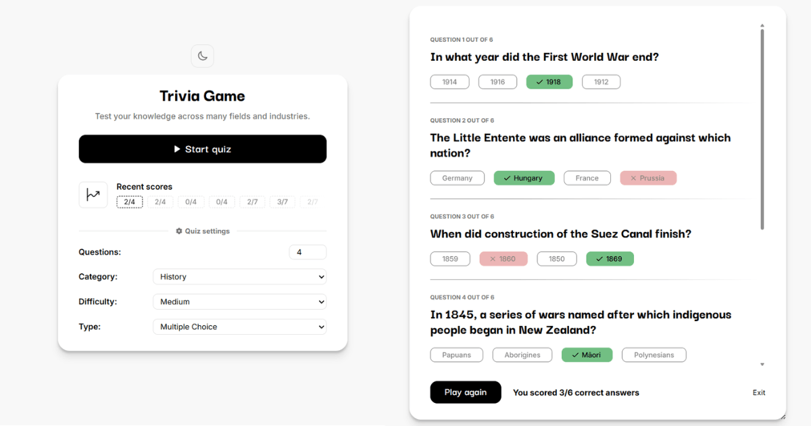

# Trivia Game

Test your knowledge by playing trivia quizzes in which you answer questions of varying difficulty from categories of your choice. Keep track of your recent scores.

**Live demo:** [paulius-trivia.netlify.app](https://paulius-trivia.netlify.app/)

## About

I built this to get familiar with React and its concepts, like components, hooks, state management, etc.

It's a simple trivia game app in which you pull random questions from the Open Trivia DB and then get scored based on how many questions you answered correctly.

## Features

- Pull random questions from the Open Trivia DB.
- Change quiz settings to configure the number of questions, their difficulty, type and category.
- Submit your answers and see which questions you answered correctly.
- Track your recent scores.
- Your recent scores and quiz settings are saved in localStorage and persist between site visits.
- Toggle theme between light and dark modes.
- Responsive layout with accessibility basics.

## Built with

- React
- Open Trivia DB API
- localStorage
- Hosted on Netlify

## What I learned

Building this app helped me get more familiar with core React concepts. I used React Context to share game state and settings across components without prop drilling, and learned how lazy state initialization avoids unnecessary reads from localStorage on every render. I also got experience syncing React state to external systems with `useEffect` - writing the current theme to the DOM and localStorage whenever it changes. For values that needed to persist without triggering a re-render (score history, etc), I used `useRef` instead of state.

Implemented async state handling by giving the app loading, error, and success states that include error messages tailored to the situation (a 429 status versus a lost internet connection, for example). I also learned the value of shaping API data once, right after fetching it, decoding HTML entities, shuffling answers and assigning stable IDs to elements. I also used React's form `action` prop together with `FormData` to read submitted answers and added validation to catch unanswered questions before scoring the quiz.

## Running locally

1. Clone the repo
2. Run `npm install` to install dependencies
3. Run `npm run dev` to start the local dev server

## Future improvements

The app could be improved by adding an optional timer to quizzes, which would end the quiz if time runs out. Letting users register an account, implementing a real database and adding a leaderboard would also be a big improvement.
